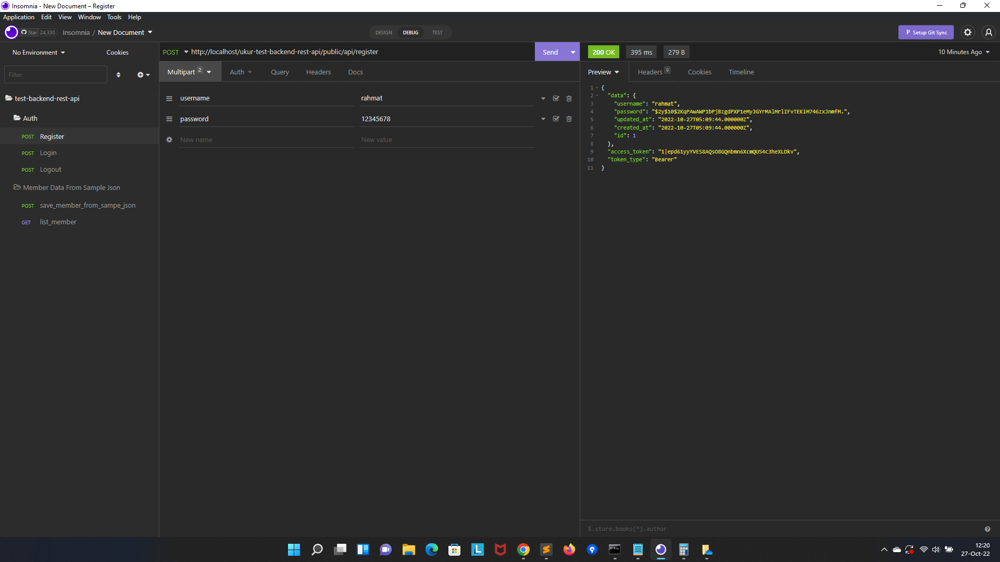
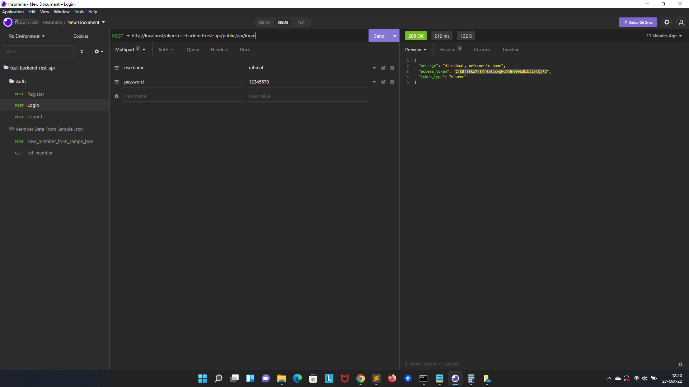
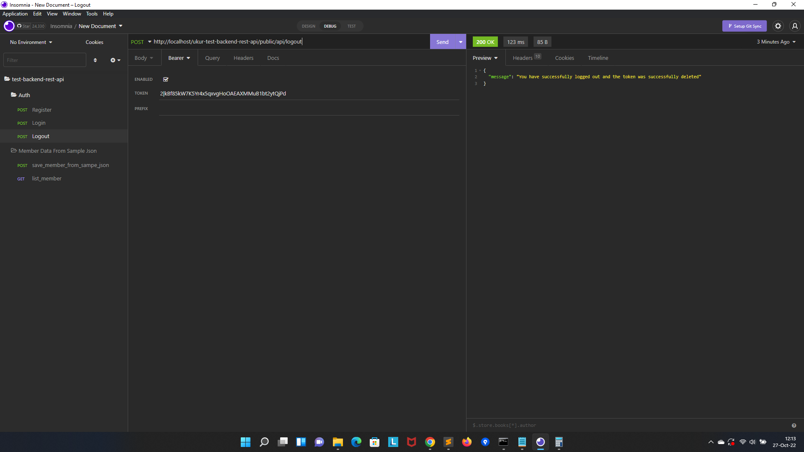
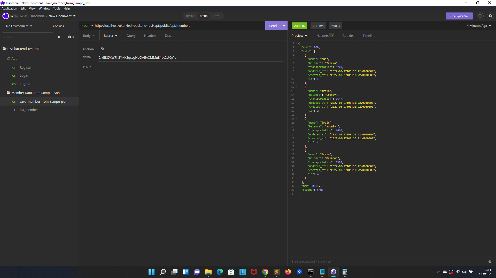

# Requirements
```
	PHP 7.4
	Laravel 8
	Mysql 5.7.36
```


# Installation

1. Clone this repo

```
git clone https://github.com/mohrahmatullah/ukur-test-backend-rest-api.git
```


2. Setup

```
$ cd ukur-test-backend-rest-api
$ composer install
$ php artisan key:generate
$ copy .env.example .env

put database credentials in .env file
```

3. Migrate and insert records

```
$ php artisan migrate
```

atau bisa import database dari folder
```
	sql/ukur-test-backend-rest-api.sql
```

4. Insomnia

```
	- Silahkan Import file json insomnia ke aplikasi insomnia untuk melihat formatnya insomnia collection
	- filenya ada di folder
	
	insomnia/insomnia..

```


## User Registration.



## User Login.



## User Logout.



## Save Member To Database FROM file sample.json With Token and BALANCE kurang dari 10.000.



## List Member from database With Token, data dari sample json yang BALANCE kurang dari 10.000.


